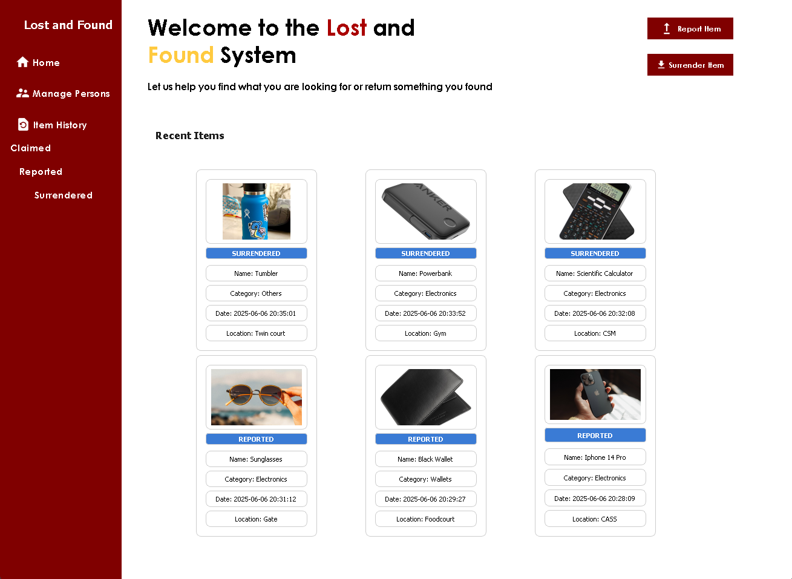
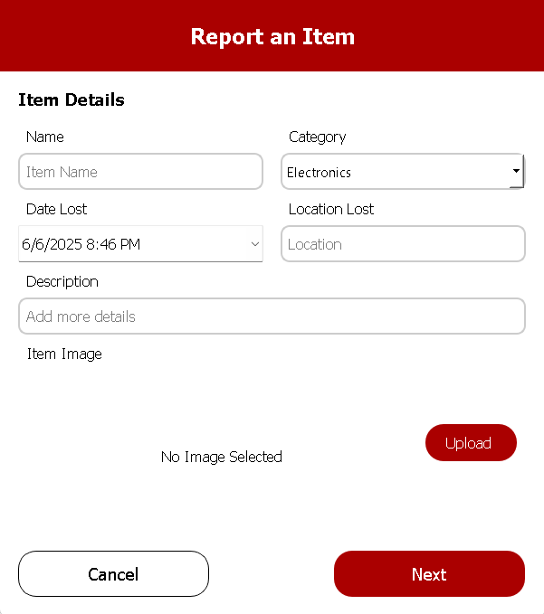
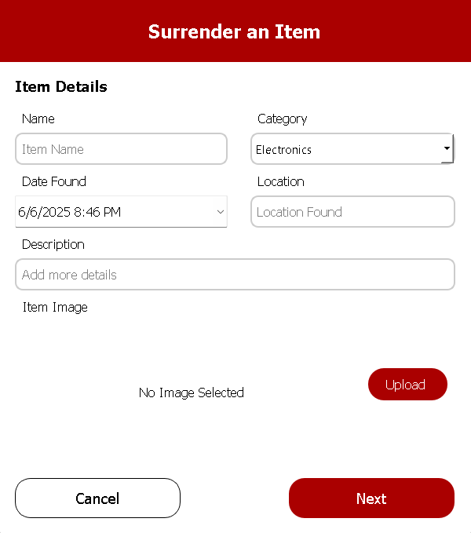
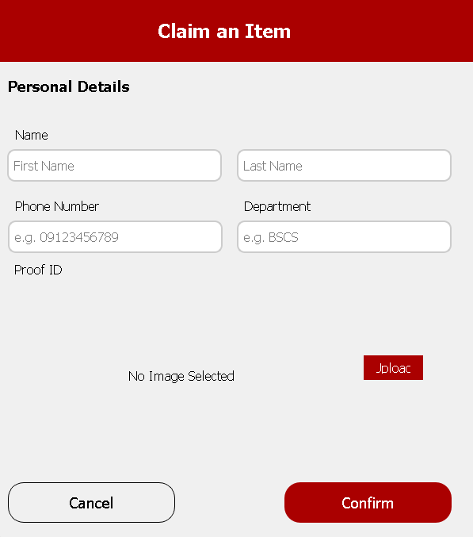
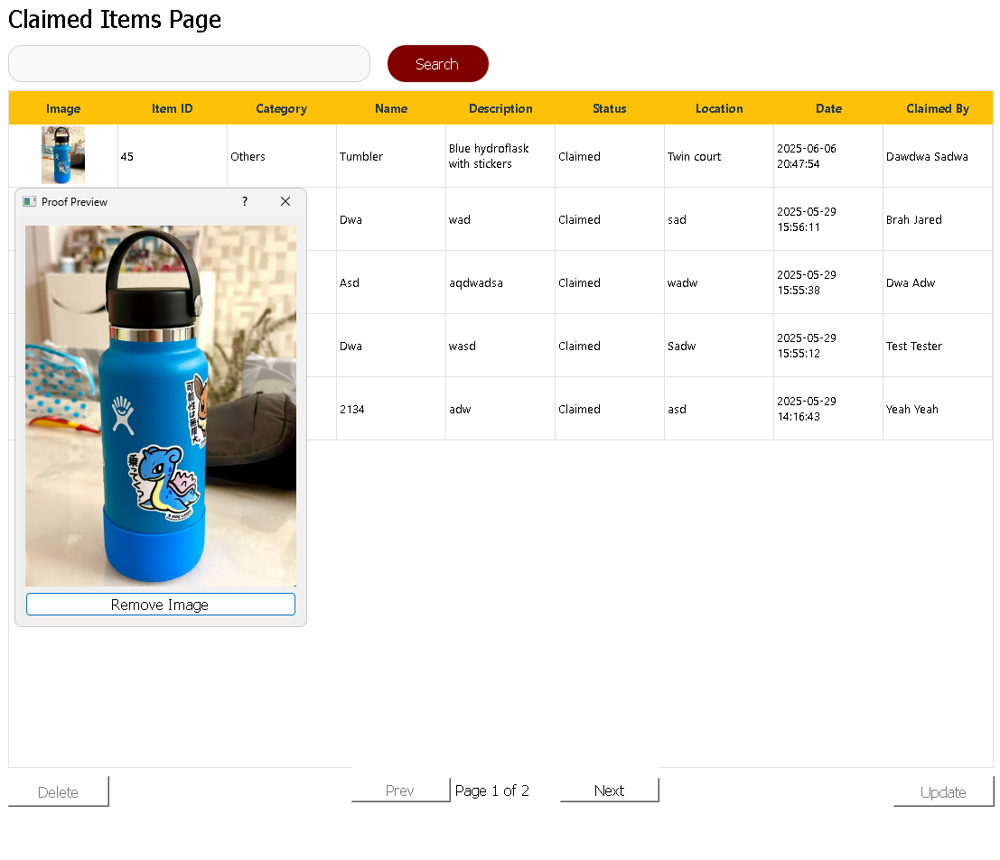

# lost-and-found-system

A desktop application for managing reported, surrendered, and claimed items, built for SID Office operations. Designed to keep accurate item records and streamline the lost-and-found process using a local database and image support.

---

## Features
- Recent Reported and Surrendered Items

- Report Lost Items

- Surrender Found Items

- Claim Items 

- Clickable image previews with remove functionality

- Search & Filter with Pagination
---

## Built With
- Python 3.11
- PyQt5
- MySQL
- Pillow

---

